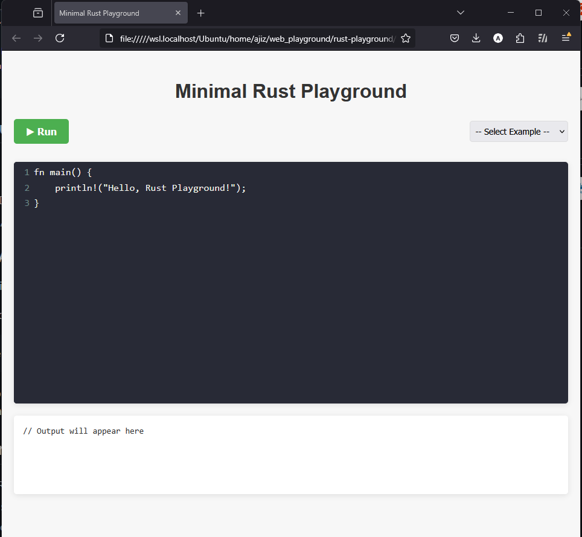

# Minimal Rust Playground

A simple web-based playground for running Rust code in the browser.


## Project Structure

```
rust-playground/
├── backend/
│   ├── src/
│   │   └── main.rs
│   ├── Cargo.toml
│   ├── Cargo.lock
│   └── Dockerfile
├── frontend/
│   └── index.html
├── docker-compose.yml
└── README.md
```

## Setup Instructions

### Prerequisites

- Docker and Docker Compose installed on your system
- Git (optional, for cloning the repository)

### Running the Application

1. Create the directory structure and files as shown above.

2. Start the Docker containers:

```bash
docker-compose up --build
```

3. Open your browser and navigate to the frontend:
   - Open the `frontend/index.html` file directly in your browser

## How It Works

- **Backend**: A Rust server built with Actix Web that compiles and executes Rust code
- **Frontend**: A simple HTML page with a CodeMirror editor that sends code to the backend
- **Docker**: Handles the containerization of the backend service

## API Endpoints

- `GET /health` - Health check endpoint
- `POST /execute` - Endpoint to compile and run Rust code
  - Request body: `{ "code": "your_rust_code_here" }`
  - Response: `{ "success": true|false, "output": "stdout", "error": "stderr" }`

## Security Considerations

This is a minimal playground intended for educational purposes. In a production environment, you would need to consider:

- Sandboxing the code execution
- Adding rate limiting
- Implementing authentication
- Setting up memory and CPU limits
- Adding timeouts for long-running code

